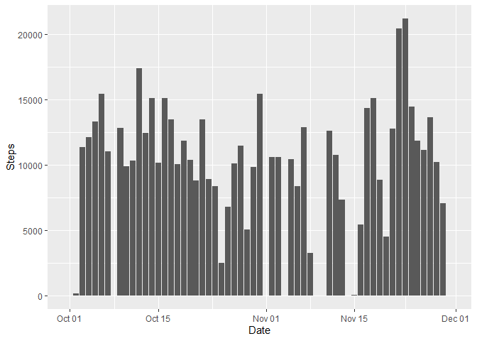
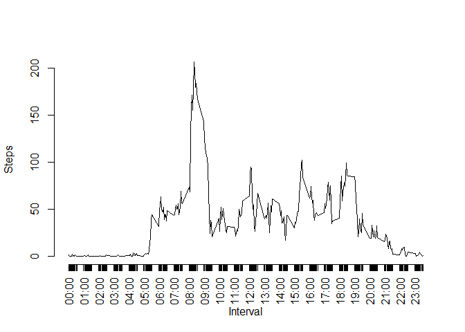
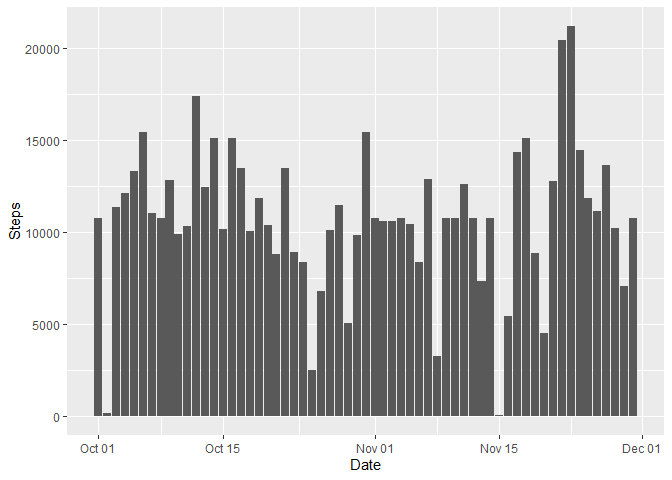
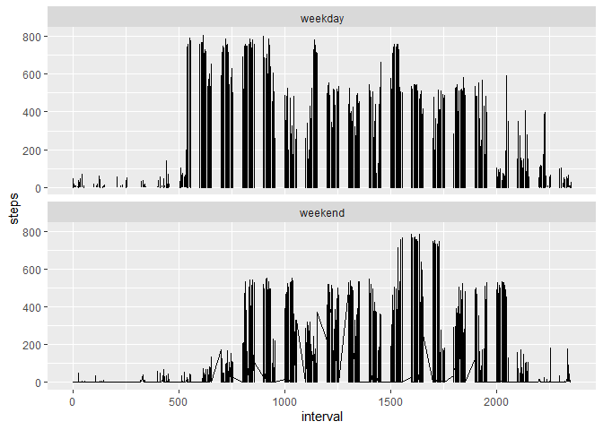

## Loading and preprocessing the data
Activity data is stored in a csv file inside a zip archive.

```r
library(dplyr)

## Unzip the data
unzip("./activity.zip") 

## Load the .csv into memory and preview its contents
activity <- as_tibble(read.csv("./activity.csv")) %>% print() 
```

```
## # A tibble: 17,568 x 3
##    steps date       interval
##    <int> <chr>         <int>
##  1    NA 2012-10-01        0
##  2    NA 2012-10-01        5
##  3    NA 2012-10-01       10
##  4    NA 2012-10-01       15
##  5    NA 2012-10-01       20
##  6    NA 2012-10-01       25
##  7    NA 2012-10-01       30
##  8    NA 2012-10-01       35
##  9    NA 2012-10-01       40
## 10    NA 2012-10-01       45
## # ... with 17,558 more rows
```


```r
## Convert date strings to Date format
activity$date <- as.Date(as.character(activity$date), "%Y-%m-%d")
```

## What is mean total number of steps taken per day?

1. Make a histogram of the total number of steps taken each day.


```r
library(ggplot2)

## Group activity by day and calculate the daily total
daily_sum <- activity %>% group_by(date) %>% summarize(sum(steps, na.rm = TRUE))

## Rename the columns of the resulting table
names(daily_sum) <- c("Date", "Steps")

## Plot a histogram (using bar plot geometry, because 2 variables)
p1 <- ggplot(data = daily_sum, aes(Date, Steps)) + geom_bar(stat = "identity")
print(p1)
```

<!-- -->

2. Calculate and report the mean and median total number of steps taken per day.


```r
## Calculate and print each measure
daily_mean <- mean(daily_sum$Steps, na.rm = TRUE)
daily_median <- median(daily_sum$Steps, na.rm = TRUE)
```

 * Daily mean: **9354.2295082**

 * Daily median: **10395**


## What is the average daily activity pattern?

1. Make a time series plot of the 5-minute interval and average number of steps
taken averaged across all days.


```r
## Group by time interval and calculate the mean for each
intervals <- activity %>% 
  group_by(interval) %>% 
  summarize(mean(steps, na.rm = TRUE)) %>%
  mutate(Time = paste(sprintf("%02d", floor(interval / 100)), ":", 
               sprintf("%02d", interval %% 100), sep = ""))

## Format the interval integers into character vectors
#intervals$Time <- paste(sprintf("%02d", floor(intervals$interval / 100)), ":", 
#               sprintf("%02d", intervals$interval %% 100), sep = "")

## Rename the columns
names(intervals) <- c("Interval", "Steps", "Time")

## Plot the interval averages, then apply axis labels
with(intervals, plot(Interval, Steps, type = "l", axes = FALSE, xlab = "Interval"))
axis(2)
axis(1, at = intervals$Interval,labels = intervals$Time, las = 2)
```

<!-- -->


2. Which 5-minute interval, on average across all the days in the dataset, 
contains the maximum number of steps?


```r
## Identify the maximum interval step average
max_steps = which.max(intervals$Steps)
```

 * Max Steps Taken: **08:35** 
 
## Imputing missing values

1. Calculate and report the total number of missing values in the dataset.


```r
## Count complete cases, subtract from total
missing_values = nrow(activity) - sum(complete.cases(activity))
```

 * Total rows with NAs: **2304**
 
2. Devise a strategy for filling in all of the missing values in the dataset.


```r
## Using interval step averages to impute missing values
mean_steps <- intervals$Steps
```

3. Create a new dataset with the missing data filled in.


```r
## Impute missing data through retrieving interval mean by index
imputed_mean <- activity %>% 
  
  ## Calculate the index corresponding to mean for interval
  mutate(index = interval/5 + 1 - 8 * floor(interval/100)) %>%
  
  ## Impute the mean in place of missing interval data
  mutate(steps = ifelse(is.na(steps), mean_steps[index], steps)) %>%
  print()
```

```
## # A tibble: 17,568 x 4
##     steps date       interval index
##     <dbl> <date>        <int> <dbl>
##  1 1.72   2012-10-01        0     1
##  2 0.340  2012-10-01        5     2
##  3 0.132  2012-10-01       10     3
##  4 0.151  2012-10-01       15     4
##  5 0.0755 2012-10-01       20     5
##  6 2.09   2012-10-01       25     6
##  7 0.528  2012-10-01       30     7
##  8 0.868  2012-10-01       35     8
##  9 0      2012-10-01       40     9
## 10 1.47   2012-10-01       45    10
## # ... with 17,558 more rows
```

4. Make a histogram of the total number of steps taken each day.


```r
## Group by date and calculate the average
daily_sum2 <- imputed_mean %>% group_by(date) %>% summarize(sum(steps))

## Rename the columns
names(daily_sum2) <- c("Date", "Steps")

## Plot a histogram using bar geometry and print
p2 <- ggplot(data = daily_sum2, aes(Date, Steps)) + geom_bar(stat = "identity")
print(p2)
```

<!-- -->

 - Calculate and report the mean and median total number of steps taken per day. 

```r
## Calculate the new mean, median, and differences 
daily_mean2 <- mean(daily_sum2$Steps)
daily_mean_diff <- daily_mean2 - daily_mean
daily_median2 <- median(daily_sum2$Steps)
daily_median_diff <- daily_median2 - daily_median
```

 * Daily mean: **1.0766189\times 10^{4}** up **1411.959171** from previous.

 * Daily median: **1.0766189\times 10^{4}** up **371.1886792** from previous.
 
 - The impact of imputing missing data has a more significant difference on the 
 than the median, indicating the latter is a more robust measure of central
 tendency.
 
## Are there differences in activity patterns between weekdays and weekends?

1. Create a new factor variable in the dataset with two levels – “weekday” and 
“weekend” indicating whether a given date is a weekday or weekend day.


```r
## Create a vector of weekday names
days_of_week = c("Monday", "Tuesday", "Wednesday", "Thursday", "Friday")

## Add a column comparing outcome of 'weekdays' function to vector of qualifying
## weekday names, applying factor labels
weekdays_ends <- activity %>% 
  mutate(dayofweek = as.factor(ifelse(weekdays(date) %in% 
                                        days_of_week, "weekday", "weekend")))

## Show the resulting sum of each factor
table(weekdays_ends$dayofweek)
```

```
## 
## weekday weekend 
##   12960    4608
```

2. Make a panel plot containing a time series plot of the 5-minute interval 
(x-axis) and the average number of steps taken, averaged across all weekday days
or weekend days (y-axis). 


```r
## Plot the data using line geometry
p3 <- ggplot(data = weekdays_ends, mapping = aes(interval, steps)) +
  geom_line(na.rm = TRUE)

## Produce two panels, based on weekday facet
p3 + facet_wrap(vars(dayofweek), nrow = 2)
```

<!-- -->
